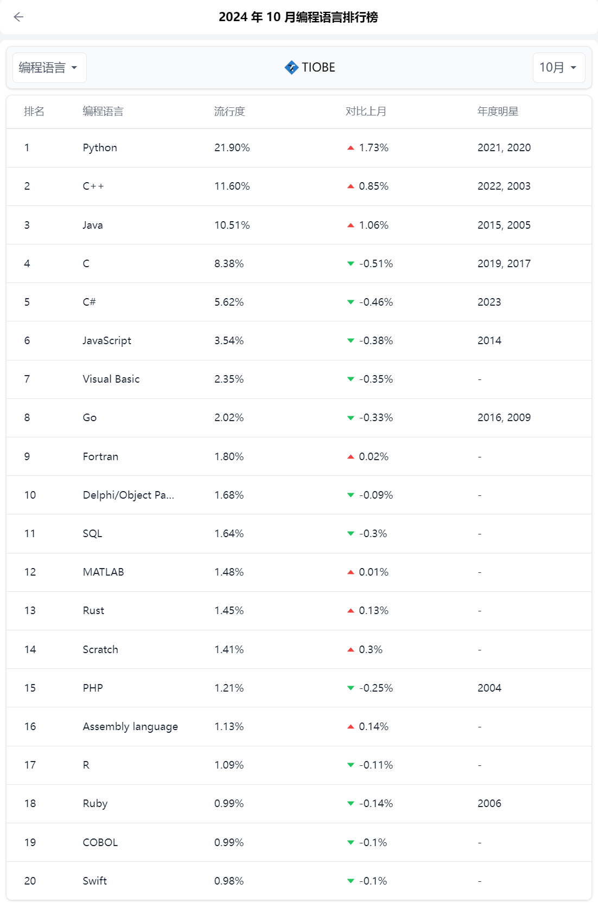

# Python 开发环境

## Python 介绍
Python由荷兰国家数学与计算机科学研究中心的吉多·范罗苏姆于1990年代初设计，作为一门叫做ABC语言的替代品。 
Python提供了高效的高级数据结构，还能简单有效地面向对象编程。Python语法和动态类型，以及解释型语言的本质，使它成为多数平台上写脚本和快速开发应用的编程语言， 随着版本的不断更新和语言新功能的添加，逐渐被用于独立的、大型项目的开发。  
Python在各个编程语言中比较适合新手学习，Python解释器易于扩展，可以使用C、C++或其他可以通过C调用的语言扩展新的功能和数据类型。 Python也可用于可定制化软件中的扩展程序语言。Python丰富的标准库，提供了适用于各个主要系统平台的源码或机器码。 
https://baike.baidu.com/item/Python/407313?fr=ge_ala

## 编程语言排名
https://hellogithub.com/report/tiobe  
2024年10月编程语言前20

## Python基础教程
Python 3 菜鸟教程 https://www.runoob.com/python3/python3-tutorial.html
ProgrammingDigitalHumanitiesBook  
https://github.com/1110sillabo/ProgrammingDigitalHumanitiesBook

## Python 官网
Python官网 https://www.python.org/downloads/  
建议安装3.8以上, 2024-10-07后3.8版本停止更新

## Python包管理: pip 或者 pip3
1. 安装包 
pip install 包名称
2. 安装特定版本的包  
pip install 包名称==3.0.8（指定的版本）
3. 查看安装的包  
pip list
4. 升级pip本身  
pip install --upgrade pip
5. 升级包  
pip upgrade 包名称
6. 卸载包 
pip uninstall 包名称
7. 帮助 
pip -h

## 在线编程
1. https://www.anycodes.cn/
2. https://replit.com/
3. https://ideone.com/

